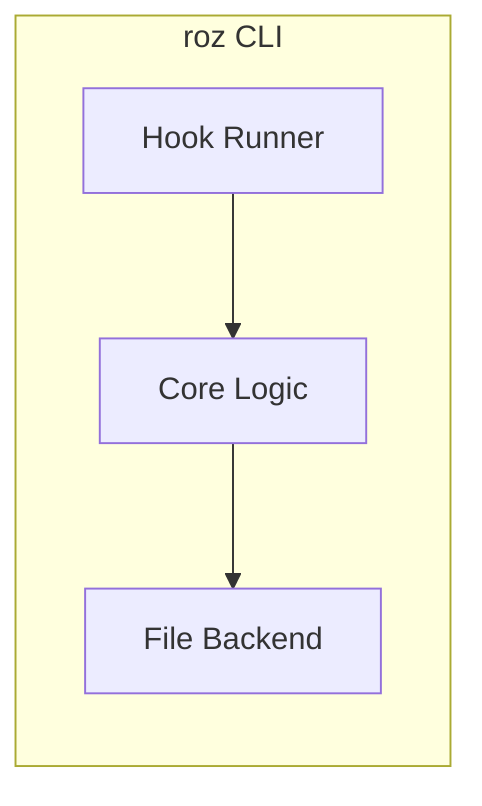
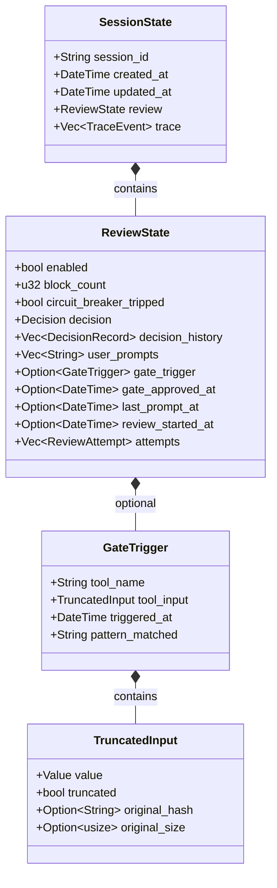
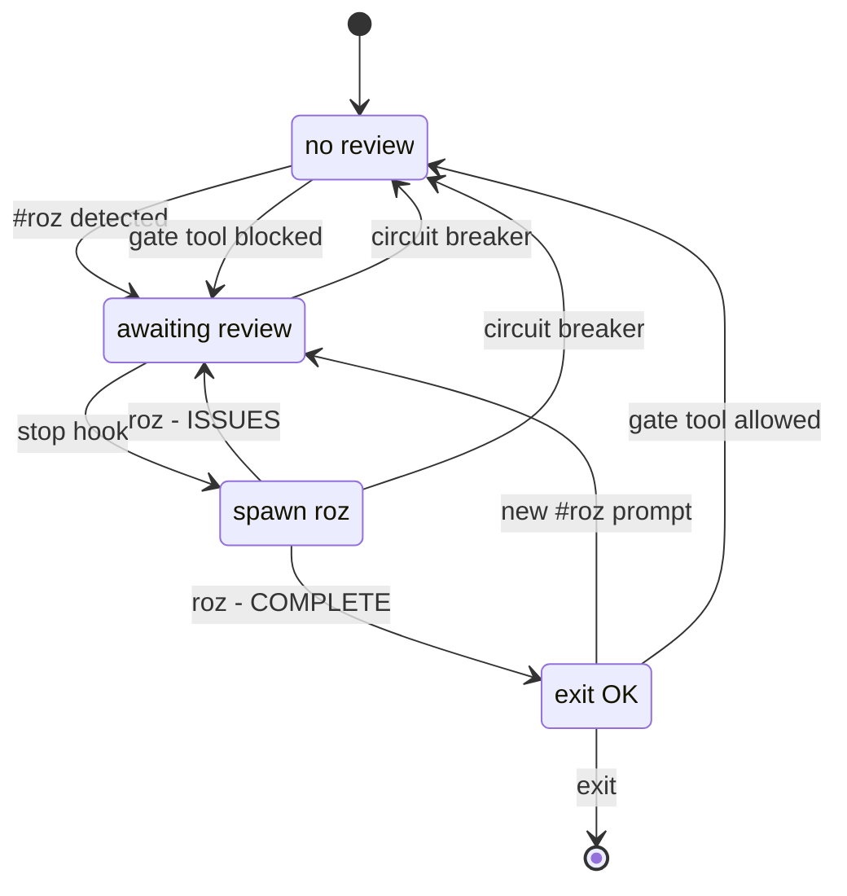
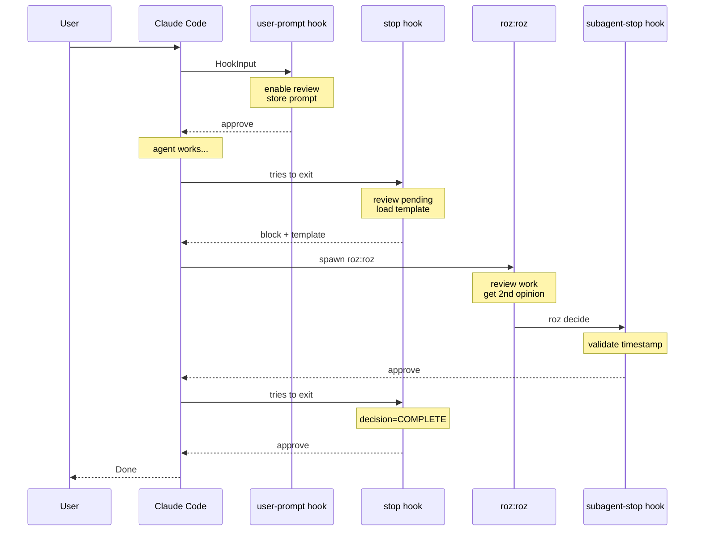
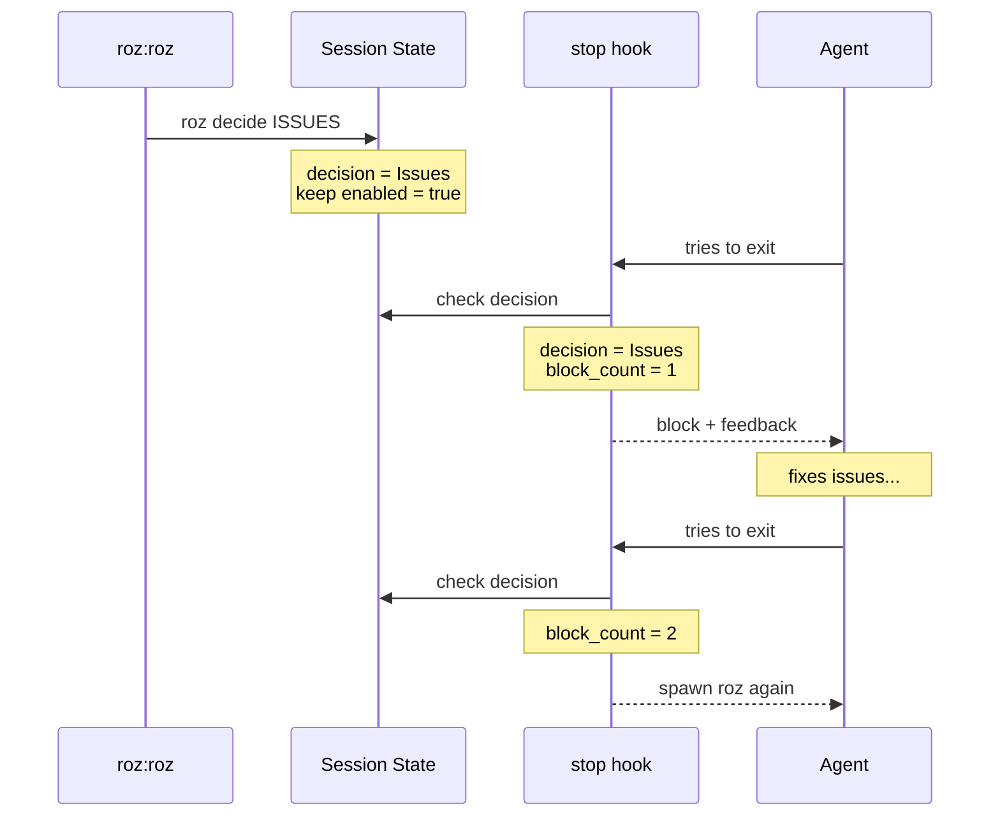
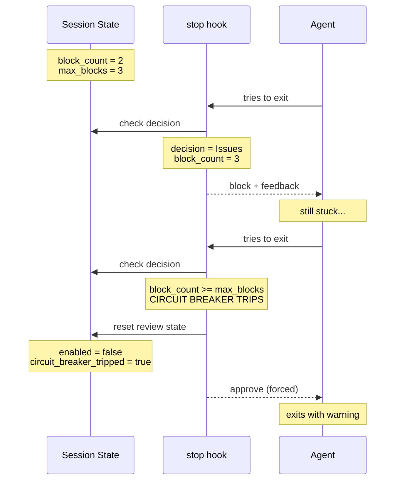
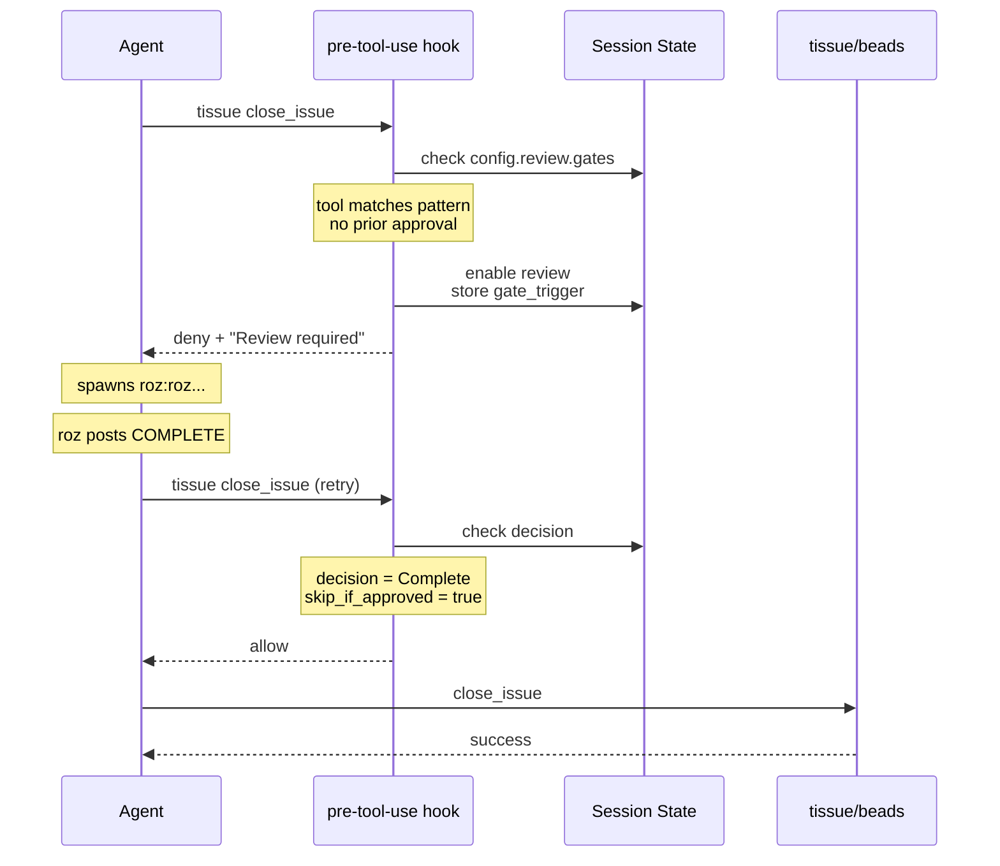
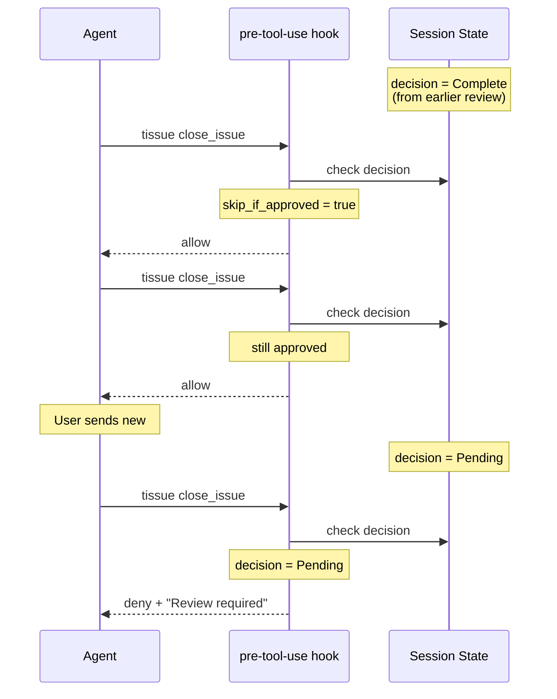
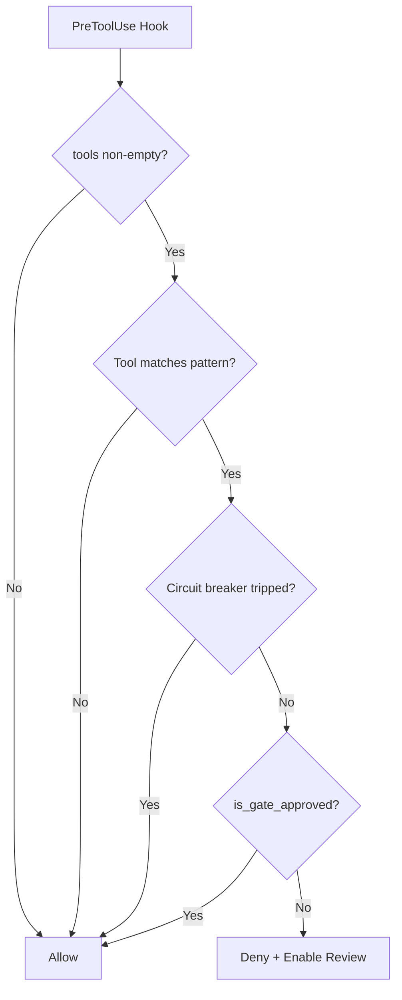
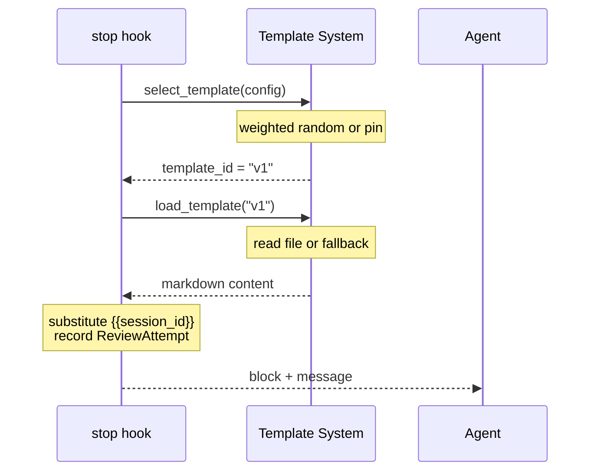

# roz - Architecture

This document describes the system architecture, domain model, and component
relationships.

## 1. System Overview



| Layer | Responsibilities |
|-------|------------------|
| **Hook Runner** | session-start, user-prompt, pre-tool-use, stop, subagent-stop dispatch |
| **Core Logic** | State machine, decision evaluation, circuit breaker |
| **File Backend** | `~/.roz/sessions/*.json` persistence |

**Layer Functions:**

- **Hook Runner**: Receives JSON from Claude Code, dispatches to appropriate
  handler
- **Core Logic**: Pure functions implementing the review state machine
- **File Backend**: Persistence layer for session state

## 2. Module Structure

### 2.1 Rust Crate

| Module | Responsibility |
|--------|----------------|
| `core/state` | SessionState, Decision, ReviewState types |
| `core/hooks` | Pure hook handler functions |
| `core/circuit_breaker` | Block limit and cooldown logic |
| `storage/traits` | MessageStore trait definition |
| `storage/file` | File-based JSON storage |
| `storage/memory` | In-memory storage for testing |
| `hooks/input` | HookInput deserialization |
| `hooks/output` | HookOutput serialization |
| `hooks/runner` | Hook dispatch and error handling |
| `cli/*` | Command implementations (hook, trace, debug, context, decide, clean, stats) |

### 2.2 Plugin Package

| Component | Purpose |
|-----------|---------|
| `.claude-plugin/plugin.json` | Plugin manifest (Claude Code format) |
| `agents/roz.md` | Reviewer agent instructions |
| `hooks/hooks.json` | Hook configuration |
| `templates/block-*.md` | Block message templates |
| `bin/roz` | Compiled binary |

## 3. Domain Model

### 3.1 Entities



**GateTrigger**: Captures context when a gate blocks a tool, so roz can review
what was attempted.

**TruncatedInput**: Tool inputs are truncated to 10KB to prevent bloated
session state. Large inputs are hashed (SHA-256) for verification, with the
original size recorded.

### 3.2 Decision States

| State | Description |
|-------|-------------|
| **Pending** | Review requested but not yet completed |
| **Complete** | Roz approved the work (includes summary and optional second opinions) |
| **Issues** | Roz found problems (includes summary and message to agent) |

### 3.3 Hook I/O

**Input** (from Claude Code):

- `session_id`: Unique session identifier
- `cwd`: Working directory
- `prompt`: User prompt (for user-prompt hook)
- `source`: Session source - startup, resume, clear, or compact (for
  session-start hook)
- `tool_name`, `tool_input`: Tool details (for pre-tool-use hook)
- `subagent_type`, `subagent_prompt`, `subagent_started_at`: Subagent details
  (for subagent-stop hook)

**Output for PreToolUse** (to Claude Code):

- `permissionDecision`: "allow", "deny", or "ask"
- `reason`: Message explaining denial (shown to agent)
- `updatedInput`: Optional modified tool input

**Output** (to Claude Code):

- `decision`: "approve" or "block"
- `reason`: Message explaining block (shown to agent)
- `context`: Additional context injected into conversation

### 3.4 Trace Events

| Event Type | Trigger |
|------------|---------|
| `SessionStart` | Session begins |
| `PromptReceived` | User submits prompt with `#roz` |
| `GateBlocked` | Pre-tool-use hook blocks a gated tool |
| `GateAllowed` | Pre-tool-use hook allows a gated tool (includes reason) |
| `ToolCompleted` | Tool finishes execution |
| `StopHookCalled` | Agent attempts to exit |
| `RozDecision` | Roz posts COMPLETE or ISSUES |
| `TraceCompacted` | Trace was truncated due to max_events limit |
| `SessionEnd` | Session terminates |

## 4. State Machine



**Transitions:**

| From | Event | To | Action |
|------|-------|----|--------|
| Idle | `#roz` in prompt | Pending | Enable review, store prompt |
| Idle | Gate tool blocked | Pending | Enable review, store gate trigger |
| Pending | Stop hook | Blocked | Block with template, increment block_count |
| Pending | Circuit breaker trips | Idle | Force approve, log warning |
| Blocked | Roz: COMPLETE | Approved | Disable review, allow exit |
| Blocked | Roz: ISSUES | Pending | Keep review enabled, provide feedback |
| Blocked | Circuit breaker trips | Idle | Force approve, log warning |
| Approved | New `#roz` prompt | Pending | Re-enable review |
| Approved | Gate tool retry | Idle | Allow tool, reset state |
| Approved | Exit | [*] | Session ends |

**Review Triggers:**

| Trigger | Hook | Description |
|---------|------|-------------|
| `#roz` prefix | user-prompt | Explicit opt-in by user |
| Gate tool match | pre-tool-use | Automatic when tool matches configured pattern |

**Approval Scope** (for gates):

| Scope | Behavior | Use Case |
|-------|----------|----------|
| `session` | Once approved, all gated tools allowed until session ends | High-trust environments |
| `prompt` | Approval resets when user sends new prompt | **Recommended** - review per task |
| `tool` | Every gated tool call requires fresh review | High-security environments |

**Scope implementation details:**

- `gate_approved_at`: Set when roz posts COMPLETE
- `last_prompt_at`: Set on every user prompt
- `review_started_at`: Set when gate blocks (marks review cycle start)

**Prompt isolation**: If user sends a prompt *during* an active review (after
gate blocks but before roz approves), that prompt is ignored for scope
purposes. This prevents "hurry up" messages from invalidating the pending
approval.

**Approval TTL**: Optional `approval_ttl_seconds` config causes approvals to
expire regardless of scope. Useful for session resumes where stale approvals
might persist.

**Bash Command Normalization**: When matching Bash tool calls against gate
patterns, commands are normalized to handle common shell patterns:

| Input | Normalized | Why |
|-------|------------|-----|
| `GH_TOKEN=x gh issue close 123` | `gh issue close 123` | Strip env var prefixes |
| `env VAR=x gh issue close` | `gh issue close` | Strip `env` command |
| `echo "y" \| gh issue close 123` | `gh issue close 123` | Match rightmost command in pipeline |
| `bash -c "gh issue close 123"` | `gh issue close 123` | Extract nested shell command |

This ensures patterns like `Bash:gh issue close*` match regardless of how the
command is invoked.

**Timestamp Validation Buffer**: The subagent-stop hook allows a 5-second
buffer after roz execution ends to account for clock skew when validating
decision timestamps.

## 5. Sequence Diagrams

### 5.1 Happy Path



### 5.2 Issues Found



### 5.3 Circuit Breaker



### 5.4 Gate: Issue Close Blocked



### 5.5 Gate: Multiple Tools in Session



### 5.6 Gate: Configurable Per-Tool



`is_gate_approved()` checks:

1. Decision is Complete
2. Approval not expired (if TTL set)
3. Approval scope rules (session/prompt/tool)

## 6. Storage Architecture

### 6.1 File Layout

```text
~/.roz/
├── sessions/
│   ├── abc123-def456.json     # SessionState (one per session)
│   └── xyz789-uvw012.json
└── config.toml                 # Optional configuration
```

### 6.2 Storage Interface

The `MessageStore` trait abstracts storage operations:

| Operation | Description |
|-----------|-------------|
| `get_session(id)` | Retrieve session by ID, returns None if not found |
| `put_session(state)` | Save session (atomic write via temp file + rename) |
| `list_sessions(limit)` | List recent sessions, sorted by creation time |
| `delete_session(id)` | Remove session file |

### 6.3 Implementations

| Backend | Use Case |
|---------|----------|
| **FileBackend** | Production - JSON files in `~/.roz/sessions/` |
| **MemoryBackend** | Testing - in-memory HashMap |

## 7. Circuit Breaker

Prevents infinite blocking loops when something goes wrong.

| Parameter | Default | Description |
|-----------|---------|-------------|
| `max_blocks` | 3 | Maximum blocks before tripping |
| `cooldown_seconds` | 300 | Time before breaker resets |

**Behavior:**

1. Each block increments `block_count`
2. When `block_count >= max_blocks`, breaker trips
3. Tripped breaker forces approve and logs warning
4. Breaker resets after cooldown or on new session

## 8. Template System

Block messages use external templates for A/B testing.

### 8.1 Template Flow



### 8.2 Attempt Tracking

Each block attempt records:

- Template ID used
- Timestamp
- Outcome (Pending -> Success/NotSpawned/NoDecision/BadSessionId)

This enables `roz stats` to compare template effectiveness.

## Related Documents

- [Overview](./00-overview.md) - Vision, core concepts, design principles
- [Implementation](./02-implementation.md) - Rust types, storage, hooks, CLI
  commands
- [Test Plan](./03-test-plan.md) - Testing strategy
- [CI](./04-ci.md) - Version management and release workflow
- [Agent Instructions](./agents-roz.md) - Full roz agent behavioral
  specification
