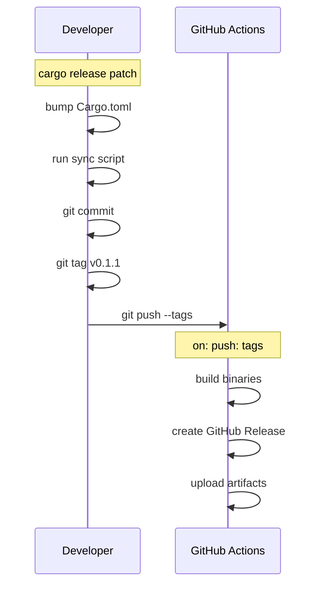

# roz - CI & Release

## 20. Version Management & Release

Version must stay in sync across multiple files:

| File | Field | Example |
|------|-------|---------|
| `Cargo.toml` | `version` | `"0.1.0"` |
| `.claude-plugin/plugin.json` | `version` | `"0.1.0"` |
| `.claude-plugin/marketplace.json` | `version` | `"0.1.0"` |

### 20.1 Approach: Local Release, CI Builds

Developer runs `cargo release` locally -> CI builds on tag push.



### 20.2 Cargo.toml Configuration

```toml
[package]
name = "roz"
version = "0.1.0"

[package.metadata.release]
# Run before version bump to sync plugin.json
pre-release-hook = ["./scripts/sync-plugin-version.sh", "{{version}}"]

# Commit message format
pre-release-commit-message = "chore: release v{{version}}"

# Tag format
tag-name = "v{{version}}"

# Push to remote
push = true
```

### 20.3 Version Sync Script

```bash
#!/bin/bash
# scripts/sync-plugin-version.sh
VERSION=$1

# Update plugin.json
jq ".version = \"$VERSION\"" .claude-plugin/plugin.json > tmp.json
mv tmp.json .claude-plugin/plugin.json

# Update marketplace.json (if exists)
if [ -f .claude-plugin/marketplace.json ]; then
    jq ".version = \"$VERSION\"" .claude-plugin/marketplace.json > tmp.json
    mv tmp.json .claude-plugin/marketplace.json
fi

# Stage the changes so cargo-release commits them
git add .claude-plugin/
```

### 20.4 GitHub Actions Release Workflow

```yaml
# .github/workflows/release.yml
name: Release

on:
  push:
    tags:
      - 'v*'

jobs:
  build:
    strategy:
      matrix:
        include:
          - os: ubuntu-latest
            target: x86_64-unknown-linux-gnu
          - os: macos-latest
            target: x86_64-apple-darwin
          - os: macos-latest
            target: aarch64-apple-darwin

    runs-on: ${{ matrix.os }}

    steps:
      - uses: actions/checkout@v4

      - name: Install Rust
        uses: dtolnay/rust-toolchain@stable
        with:
          targets: ${{ matrix.target }}

      - name: Build
        run: cargo build --release --target ${{ matrix.target }}

      - name: Rename binary
        run: |
          mkdir -p dist
          cp target/${{ matrix.target }}/release/roz dist/roz-${{ matrix.target }}

      - name: Upload artifact
        uses: actions/upload-artifact@v4
        with:
          name: roz-${{ matrix.target }}
          path: dist/roz-${{ matrix.target }}

  release:
    needs: build
    runs-on: ubuntu-latest
    permissions:
      contents: write

    steps:
      - uses: actions/checkout@v4

      - name: Download artifacts
        uses: actions/download-artifact@v4
        with:
          path: artifacts

      - name: Create Release
        uses: softprops/action-gh-release@v1
        with:
          files: artifacts/*/roz-*
          generate_release_notes: true
```

### 20.5 Developer Workflow

```bash
# Install cargo-release (one-time)
cargo install cargo-release

# Make a patch release (0.1.0 -> 0.1.1)
cargo release patch --execute

# Make a minor release (0.1.1 -> 0.2.0)
cargo release minor --execute

# Make a major release (0.2.0 -> 1.0.0)
cargo release major --execute

# Dry run (see what would happen)
cargo release patch
```

### 20.6 CI Workflow Summary

| Trigger | Action |
|---------|--------|
| Push to `main` | Run tests only |
| Push tag `v*` | Build all platforms, create GitHub Release |
| Pull request | Run tests, check formatting |

## CI Configuration Files

### Test Workflow

```yaml
# .github/workflows/test.yml
name: Test

on:
  push:
    branches: [main]
  pull_request:
    branches: [main]

jobs:
  test:
    runs-on: ${{ matrix.os }}
    strategy:
      matrix:
        os: [ubuntu-latest, macos-latest]

    steps:
      - uses: actions/checkout@v4

      - name: Install Rust
        uses: dtolnay/rust-toolchain@stable

      - name: Run tests
        run: cargo test --all-features

      - name: Check formatting
        run: cargo fmt --check

      - name: Run clippy
        run: cargo clippy -- -D warnings
```

### Dependabot Configuration

```yaml
# .github/dependabot.yml
version: 2
updates:
  - package-ecosystem: "cargo"
    directory: "/"
    schedule:
      interval: "weekly"
    commit-message:
      prefix: "deps"

  - package-ecosystem: "github-actions"
    directory: "/"
    schedule:
      interval: "weekly"
    commit-message:
      prefix: "ci"
```

## Build Targets

| Target | OS | Architecture | Status |
|--------|-----|--------------|--------|
| `x86_64-unknown-linux-gnu` | Linux | x86_64 | Supported |
| `aarch64-unknown-linux-gnu` | Linux | ARM64 | Supported |
| `x86_64-apple-darwin` | macOS | Intel | Not Supported |
| `aarch64-apple-darwin` | macOS | Apple Silicon | Supported |
| `x86_64-pc-windows-msvc` | Windows | x86_64 | Not supported |
